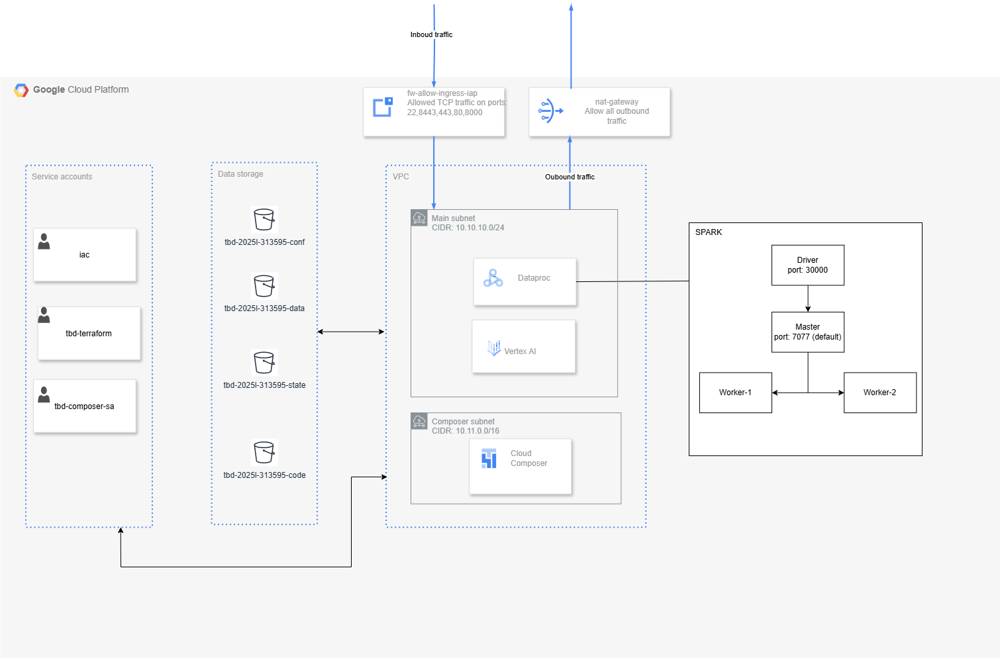

IMPORTANT ❗ ❗ ❗ Please remember to destroy all the resources after each work session. You can recreate infrastructure by creating new PR and merging it to master.
  


1. Authors:

   Group number: 12

   Repository: https://github.com/bujniasz/tbd-workshop-1
   
   Authors:
   - Aleksander Bujnowski
   - Bartłomiej Krajewski
   - Krzysztof Kluczyński
   
2. Follow all steps in README.md.

3. In boostrap/variables.tf add your emails to variable "budget_channels".


4. From avaialble Github Actions select and run destroy on main branch.


   
5. Create new git branch and:
    1. Modify tasks-phase1.md file.
    
    2. Create PR from this branch to **YOUR** master and merge it to make new release. 
    
    


6. Analyze terraform code. Play with terraform plan, terraform graph to investigate different modules.

    The **metascore** module.   

    The metastore module in Terraform is responsible for setting up a Google Cloud Dataproc Metastore service. This service provides a fully managed, scalable metastore for Apache Hive (HMS). It allows metadata management and provides interoperability between the various data processing engines and tools when working with big data on GCP.    

    Key Components:
    - _provider_ - uses the GCP provider (defined in `versions.tf`)
    - _resources_ (described in `main.tf`)
        - google_dataproc_metastore_service - configures a Dataproc Metastore service with the specified version, network, region, and project name
        - google_project_service.api-metastore - ensures that the necessary Metastore API is enabled in the project
    - _input variables_ (described in `variables.tf`)
        - var.metastore_version - specifies the version of the Metastore to be deployed.
        - var.network - network configuration for the Metastore instance.
        - var.region - region where the Metastore will be deployed.
        - var.project_name - the name of the GCP project.
    - _output_ (described in `outputs.tf`)
        - output.metastore_name - outputs the name of the created Metastore instance

     

    Graph:
    - Level 1: Root
        - starting point of the entire Terraform graph
        - the "root" node is responsible for initializing the infrastructure creation process
    - Level 2: Provider and Output
        - provider - configures the GCP provider, ensures Terraform has authorization and access to GCP resources
        - output - generates the output name of the created Metastore service, provides the result as an output variable after creation
    - Level 3: Metastore Service Creation
        - responsible for actually creating the Dataproc Metastore instance based on the provided parameters
    - Level 4: Dependent Resources (API and Parameters)
        - guarantees that all required dependencies are activated before creating the primary resource
        - holds configuration data necessary for proper Metastore initialization
    - Level 5: Provider and Project Name
        - provider - direct link to the provider in the context of used variables
        - project name - identifies the project name where the infrastructure will be created

7. Reach YARN UI
   
    ```bash
    gcloud compute ssh tbd-cluster-m --project=tbd-2025l-313595 --zone=europe-west1-d --tunnel-through-iap -- -L 8088:localhost:8088
    ```   

        


8. Draw an architecture diagram (e.g. in draw.io) that includes:
    1. VPC topology with service assignment to subnets
    2. Description of the components of service accounts
    3. List of buckets for disposal
    4. Description of network communication (ports, why it is necessary to specify the host for the driver) of Apache Spark running from Vertex AI Workbech
  
    

    ```
    spark_driver_port       = 30000
    spark_blockmgr_port     = 30001
    ```


9. Create a new PR and add costs by entering the expected consumption into Infracost
For all the resources of type: `google_artifact_registry`, `google_storage_bucket`, `google_service_networking_connection`
create a sample usage profiles and add it to the Infracost task in CI/CD pipeline. Usage file [example](https://github.com/infracost/infracost/blob/master/infracost-usage-example.yml) 

    Expected consumption:

    ```yaml
    version: 0.1
    resource_usage:
      google_artifact_registry_repository:
        storage_gb: 150                   # Total data stored in the repository in GB
        monthly_egress_data_transfer_gb:  # Monthly data delivered from the artifact registry repository in GB. You can specify any number of Google Cloud regions below, replacing - for _ e.g.:
          europe_north1: 10            # GB of data delivered from the artifact registry to europe-north1.
          australia_southeast1: 10     # GB of data delivered from the artifact registry to australia-southeast1.               # to a Google Cloud region on another continent. 
      google_storage_bucket:
        storage_gb: 45                    # Total size of bucke
        monthly_class_a_operations: 100   # Monthly number of class A operations (object adds, bucket/object list).
        monthly_class_b_operations: 100   # Monthly number of class B operations (object gets, retrieve bucket/object metadata).
        monthly_data_retrieval_gb: 60     # Monthly amount of data retrieved in GB.
        monthly_egress_data_transfer_gb:  # Monthly data transfer from Cloud Storage to the following, in GB:
          same_continent: 20    # Same continent.
          worldwide: 30         # Worldwide excluding Asia, Australia.
          asia: 10              # Asia excluding China, but including Hong Kong.
          china: 5              # China excluding Hong Kong
          australia: 10         # Australia.
      google_service_networking_connection:
        monthly_egress_data_transfer_gb:  # Monthly VM-VM data transfer from VPN gateway to the following, in GB:
          same_region: 20                 # VMs in the same Google Cloud region.
          europe: 10                      # Between Google Cloud regions within Europe.
          us_or_canada: 5                 # From a Google Cloud region in the US or Canada to another Google Cloud region in the US or Canada.
          worldwide: 30    
    ```

   Infracost Output :

   

10. Create a BigQuery dataset and an external table using SQL
    
    ***place the code and output here***
   
    ***why does ORC not require a table schema?***

11. Find and correct the error in spark-job.py

    _spark-job.py_ was failing with following error:
    
    

    which was caused by following line:

    ```
    DATA_BUCKET = "gs://tbd-2025l-9900-data/data/shakespeare/"
    ```

    Fix required changing bucket name into its actual name (with correct student id):

    ```
    DATA_BUCKET = "gs://tbd-2025l-313595-data/data/shakespeare/"
    ```

    After this change, job started to finish with success:

    


12. Add support for preemptible/spot instances in a Dataproc cluster

    Before support was added:

    

    After adding this part of code:

    [modules/dataproc/main.tf#L53-L55](https://github.com/bujniasz/tbd-workshop-1/blob/master/modules/dataproc/main.tf#L53-L55)

    Support was visible from GUI:
    

    
